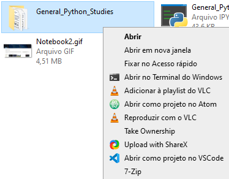

# Windows utils 

This repo contains Windows utilities, configs and things to help me recreate my windows environment if needed
Here is a list of some of the things I use and'll keep documenting as I go along:

1. Context menu for Vscode and Atom:
    editable context menu for Vscode and Atom, in this case I changed the options to brazilian portuguese. The .reg file provides an easy way to both delete old keys and remake them on the desired language.
    

*Vscode and Atom context menu*

